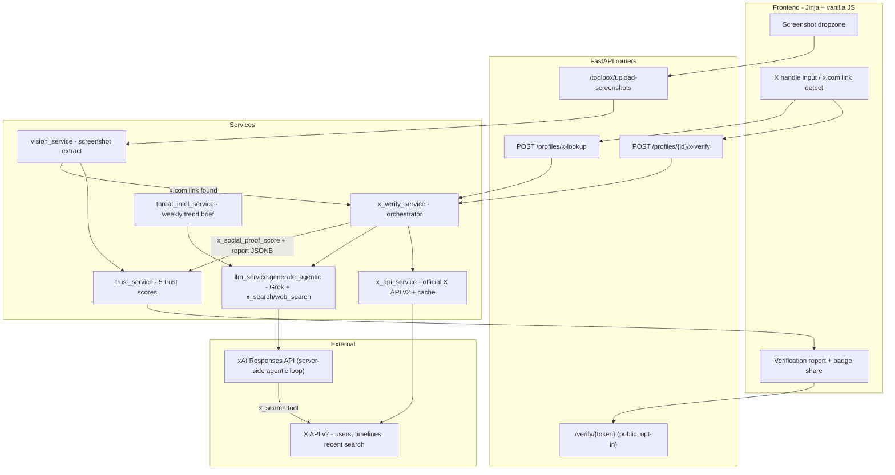

# Architecture

MatchForge is a FastAPI monolith with a service layer. v2 adds the X verification
channel: official X API v2 facts + Grok server-side agentic search, blended into
a fifth trust dimension.

## Verification data flow

1. **Input** — user submits an @handle on a profile tile (`POST /profiles/{id}/x-verify`)
   or standalone (`POST /profiles/x-lookup`, which creates a handle-first profile).
   Consent checkbox is required; only public data is touched.
2. **Ground truth** — `x_api_service.fetch_x_profile()`: user lookup + recent
   timeline via the official API, TTL-cached in the `x_profiles` table.
   `compute_x_signals()` derives deterministic social-proof signals in Python
   (account age, follower ratio, cadence, anomalies) — no LLM.
3. **Agentic investigation** — `llm_service.generate_agentic()` runs Grok with
   server-side `x_search` + `web_search` tools (`max_turns` bounded). Grok
   cross-references dating-profile claims against X evidence and the current
   threat brief, returning structured JSON plus citations and a tool-call trace.
4. **Photo cross-check** — multi-image vision call comparing the X profile
   image with dating-profile photos.
5. **Blend** — deterministic score and Grok's qualitative score average 50/50
   into the **X Social Proof Score**; a photo mismatch applies a penalty.
6. **Persist** — report stored on `profiles.x_verification` (JSONB), score on
   `profiles.x_social_proof_score` and `rankings.x_social_proof_score`;
   `compute_trust_summary()` reweights the overall trust score with the fifth
   dimension; percolation priority nudges up/down.

## Trust pipeline (per screenshot upload)

vision extract → per-photo trust (vision) → bot text check (fast model) →
catfish synthesis (reasoning model, **threat brief injected**) → web vetting →
ranking → trust-adjusted scores.

## Data model additions (v2)

| Table / column | Purpose |
|---|---|
| `x_profiles` | TTL cache of X user data + timeline + computed signals |
| `profiles.x_social_proof_score` | Blended fifth trust score |
| `profiles.x_verification` (JSONB) | Full verification report (verdict, claims, citations, trace) |
| `rankings.x_social_proof_score` | Score surfaced on the shortlist |

## Key modules

| Module | Role |
|---|---|
| `app/services/llm_service.py` | All xAI calls: vision, text, JSON, and `generate_agentic` (server-side tools, citations, trace) |
| `app/services/x_api_service.py` | Official X API v2 client, cache, deterministic scorer |
| `app/services/x_verify_service.py` | Verification orchestrator, prompts, score blending, persistence |
| `app/services/threat_intel_service.py` | Weekly trend brief from X (seeded fallback) |
| `app/api/x_verify.py` | Verification, lookup, questions, and share endpoints |
| `app/utils/badge_image.py` | Pillow-rendered OG badge card |
